# Data Exploration

We explore the data before analyzing it. This is a good practice for us, data analysts.  

> *"Since this dataset is not explicitly provided by a data engineer or supervisor for a specific analysis, our first step is to check the time frame of the data to make sure it matches what we need for our analysis."*

```sql
SELECT
	MIN(order_date) AS min_order_date,
	MAX(order_date) AS max_order_date
FROM retail.orders;
```

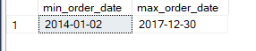

**How many unique customers are there in the `customers` table?**

```sql
SELECT
	COUNT(DISTINCT customer_id) AS unique_customers
FROM retail.customers;
```

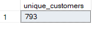

**How many unique products are there in the `products` table?**

```sql
SELECT
	COUNT(DISTINCT product_id) AS unique_products
FROM retail.products;
```

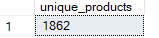

**What shipping methods are used for nationwide product distribution?**

```sql
SELECT DISTINCT
	ship_mode 
FROM retail.orders;
```

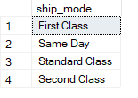

**What are the company's customer segments?**

```sql
SELECT DISTINCT	
	segment
FROM retail.customers;
```

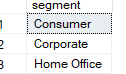

**What product categories do they offer?**

```sql
SELECT DISTINCT
	category
FROM retail.products;
```

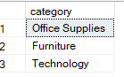

**How many product units were sold, and how much revenue was generated? How much profit was earned**?

```sql
SELECT 
	SUM(sales) AS revenue,
	SUM(quantity) AS total_qty,
	SUM(profit) AS profit
FROM retail.orders;
```

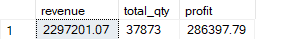

**How many sales were generated for each customer segment?**

```sql
SELECT
	segment,
	SUM(sales) AS total_sales
FROM retail.orders o
JOIN retail.customers c
	ON o.customer_id = c.customer_id
GROUP BY segment
ORDER BY total_sales DESC;
```

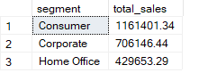

**What is the total sales volumn for each product category and sub-category?**

```sql
SELECT
	category,
	sub_category,
	SUM(sales) AS total_sales
FROM retail.orders o
JOIN retail.products p
	ON o.product_id = p.product_id
GROUP BY 
	category,
	sub_category
ORDER BY total_sales DESC;
```

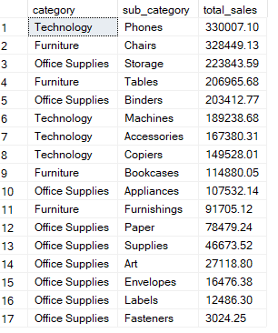

**How much sales were generated for each state?**

```sql
SELECT
	state,
	SUM(sales) AS total_sales
FROM retail.orders o
JOIN retail.geographic_locations g
	ON o.location_id = g.location_id
GROUP BY state
ORDER BY total_sales DESC;
```

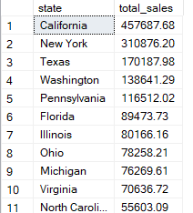

**What are the total sales, total profits and their profit ratio for each shipping methods**?

> *"We only explore shipping methods at a high level and will not conduct further analysis on this subject, as it deviates from our main objective."*

```sql
SELECT
	ship_mode,
	SUM(sales) AS total_sales,
	SUM(profit) AS total_profits,
	SUM(profit) / SUM(sales) AS profit_ratio
FROM retail.orders
GROUP BY ship_mode
ORDER BY total_sales DESC;
```

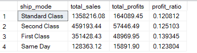

**What is the discount distribution for all products?**

```sql
SELECT 
	discount,
	COUNT(*) AS count
FROM retail.orders
WHERE discount <> 0.00
GROUP BY discount
ORDER BY count DESC;
```

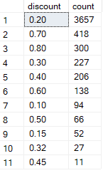

> [!NOTE]
> *"We conduct a high-level exploration of discount values. Further analysis on this topic will be performed in the deep analysis phase."*

```sql
SELECT 
	discount,
	SUM(sales) AS total_sales,
	SUM(profit) AS total_profits,
	ROUND(SUM(profit) / SUM(sales), 2) AS profit_ratio
FROM retail.orders
WHERE discount <> 0.00
GROUP BY discount
ORDER BY total_sales DESC;
```

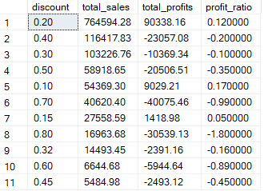

> [!NOTE]
> *"Most discounted sales show a **negative** profit value, which is noteworthy. Further analysis is needed to understand this trend."*

[Here](./Diving%20into%20the%20Analysis.md) we go to the next step.
