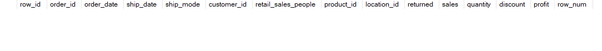
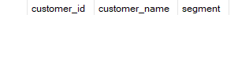
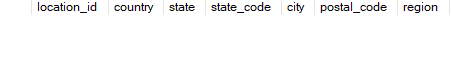
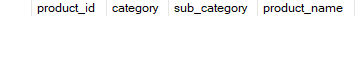
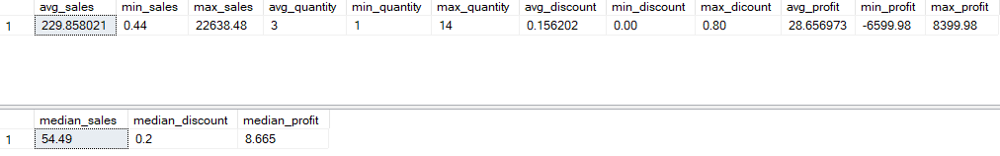
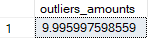

# Validating Data Integrity

## Check Duplicated Values

We ensure that there is no duplicated values in the `orders` table.

```sql
WITH check_duplicates_cte AS (
	SELECT 
		*,
		ROW_NUMBER() OVER(PARTITION BY 
			row_id,
			order_id,
			order_date,
			ship_date,
			ship_mode,
			customer_id,
			retail_sales_people,
			product_id,
			location_id,
			returned,
			sales,
			quantity,
			discount,
			profit ORDER BY row_id) as row_num
	FROM retail.sales
)

SELECT * 
FROM check_duplicates_cte 
WHERE row_num > 1;
```



**How about the `customers` table?**

```sql
SELECT *
FROM retail.customers
WHERE customer_name IS NULL
	OR segment IS NULL;
```



**How about the `geographic_locations` table?**

```sql
SELECT *
FROM retail.geographic_locations
WHERE country IS NULL
	OR region IS NULL;
```



**How about the `products` table?**

```sql
SELECT *
FROM retail.products
WHERE category IS NULL
	OR sub_category IS NULL
	OR product_name IS NULL;
```



---

## Check Outliers

We check any outliers from numerial values of `orders` table.

```sql
SELECT
	AVG(sales) AS avg_sales,
	MIN(sales) AS min_sales,
	MAX(sales) AS max_sales,
	AVG(quantity) AS avg_quantity,
	MIN(quantity) AS min_quantity,
	MAX(quantity) AS max_quantity,
	AVG(discount) AS avg_discount,
	MIN(discount) AS min_discount,
	MAX(discount) AS max_dicount,
	AVG(profit) AS avg_profit,
	MIN(profit) AS min_profit,
	MAX(profit) AS max_profit
FROM retail.orders;

SELECT DISTINCT
	PERCENTILE_CONT(0.5) WITHIN GROUP (ORDER BY sales) OVER() AS median_sales,
	PERCENTILE_CONT(0.5) WITHIN GROUP (ORDER BY discount) OVER() AS median_discount,
	PERCENTILE_CONT(0.5) WITHIN GROUP (ORDER BY profit) OVER() AS median_profit	
FROM retail.orders;
```



*The average and median values are significantly higher than expected, which may indicate the presence of numerous outliers in this table.*

Let's analyze the number of outliers.

```sql
SELECT COUNT(*) * 100.0 / (SELECT COUNT(*) FROM retail.orders) AS outliers_amounts
FROM retail.orders
WHERE sales < (SELECT DISTINCT PERCENTILE_CONT(0.05) WITHIN GROUP (ORDER BY sales) OVER() FROM retail.orders)
	OR sales > (SELECT DISTINCT PERCENTILE_CONT(0.95) WITHIN GROUP (ORDER BY sales) OVER() FROM retail.orders);
```



> [!NOTE]
> Even though outliers account for 10% of sales, their related values should not be removed due to the **diversity of products**. Instead of removing these values, we will perform a **segment analysis** in the next step based on the `sales` column.

[Here](./Data%20Exploration.md) we go to the next step.
